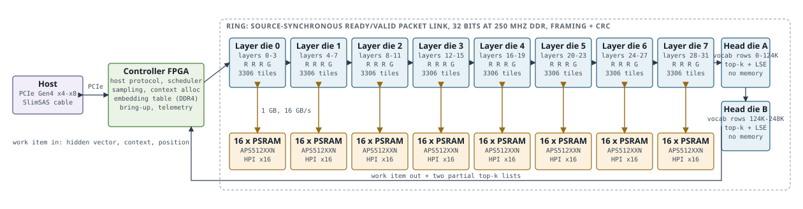
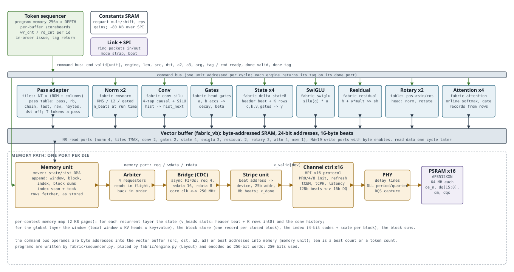
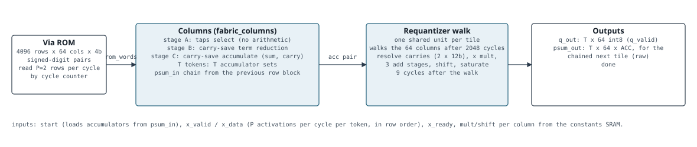

# Block diagrams and interface contracts

The appliance, a layer die and a tile, then the contracts of the interfaces between the blocks, transcribed from the RTL. `python -m fabric.docs.draw_blocks` redraws the diagrams and `python -m fabric.docs.blocks_doc` rewrites this file.

## The appliance

One board: a controller FPGA on PCIe and a ring of ten ASICs of one design. Eight run four consecutive layers each (three Gated DeltaNet recurrent layers and one gated-attention global layer), two run in head mode and hold half of the 248K-row LM head each. A work item (one token of one context: the hidden vector, the context id, the position) enters at die 0, passes through every die, and leaves the head dies with two partial top-k lists that the FPGA merges and samples. Every die works on a different context's token at once, so the appliance's throughput is one die's and a single conversation sees the ring's latency.

| Interface | Carries | Contract |
| --- | --- | --- |
| Host link | PCIe Gen4 x4 to x8 over a SlimSAS cable | The FPGA terminates PCIe and owns the host protocol, scheduling, sampling, context allocation and telemetry. |
| Ring link (die to die) | Work items: hidden vector (4096 x 16 bit), context id, position; head dies append their partial lists | Source-synchronous ready/valid packets with framing and CRC; candidate 32 data bits at 250 MHz DDR, 2 GB/s raw. A die forwards the item unchanged and replaces the hidden vector (layer mode) or appends its list (head mode). |
| Die memory | Per-context state of the die's four layers (see the memory map) | 16 AP Memory APS512XXN PSRAMs in HPI x16 mode per layer die, 1 GB, 16 GB/s at 250 MHz, in 2 KB stripes across the devices; head dies have none. |
| Management SPI | Boot: the ~80 KB of per-column requantizer constants and unit constants; the mode strap | Loaded into the constants SRAM before the first work item. |

## A layer die

The die is a token sequencer, a vector buffer, the units behind their adapters, and one memory path. The sequencer runs a layer program (a list of unit commands with the buffers each consumes and produces) in order, issuing a command when its buffers' scoreboards are clear and the addressed engine is free; the engine returns the command's tag when its last write has landed. Every unit reads its operands from and writes its results to the vector buffer at byte addresses the program carries, so the buffer is the only coupling between units. The memory unit is the one requester of the die's memory port: the state and history moves of the recurrent layers, the append, the index scan and the record reads of the global layer.

| Block | Role | Instances (9B die) |
| --- | --- | --- |
| Token sequencer | Microcoded issue engine: program memory of 256-bit words, per-buffer-id writer and reader counters, tag table | 1 |
| Vector buffer | Byte-addressed SRAM, 16-byte beats, one read port per unit stream and 19 write ports | 1, 312 KB for a recurrent token, 1.2 MB for a global token |
| Tile array (pass adapter) | The four passes of a layer (in, out+gates, FFN gate/up, FFN down) over NT tiles of 4096 x 64 via-ROM coefficients | 3306 tiles |
| Norm | RMS norm with a gain; the L2 normaliser and the gated norm by its arguments | 2 engines |
| Conv | 4-tap causal convolution with SiLU over the q, k, v channels, history in and out | 1 |
| Gates | Per-head decay and beta from the pass's one-column accumulators | 1 |
| State engine | The int8 Gated DeltaNet update of one head (128 x 128 rows) with its scale header | 4 engines |
| SwiGLU | silu(gate) * up, requantized | 1 |
| Residual | h + y * mult >> shift in int16 | 1 |
| Rotary | Table: sin/cos of the position; head: head norm, rotation of the first RD dims, int8 | 2 engines |
| Attention | Online-softmax attention of a query group over the head's window and block rows, gated output | 4 cores (one per KV head) |
| Memory unit | Mover, append, index scan with top-K, record reader, behind a 4-way arbiter | 1 |
| Memory path | Bridge (clock crossing), stripe unit, 16 channel controllers, PHY (delay lines, DLL) | 1 path, 16 channels |

## A tile

A tile is a via-programmed ROM of 4096 rows by 64 columns of 4-bit signed-digit coefficients, read two rows per cycle by a cycle counter, feeding 64 columns that accumulate in carry-save form and a shared requantizer that walks the columns after the 2048-cycle pass. With T tokens a pass, the columns keep T accumulator sets and the activations of T tokens arrive together.

| Signal | Direction | Width | Meaning |
| --- | --- | --- | --- |
| start | in | 1 | Begins a pass: loads the accumulators from psum_in (zero for a fresh pass, the previous row block's psum_out for a chained one) and resets the cycle counter. |
| psum_in | in | T x COLS x ACC | Chained partial sums, raw accumulators of the tile whose rows precede this one. |
| x_valid / x_data / x_ready | in / in / out | 1 / T x P x AB / 1 | P=2 activations per cycle per token in row order; x_ready is high while a pass is running. |
| mult / shift | in | COLS x 16 / COLS x 5 | Per-column requantizer constants from the constants SRAM. |
| done | out | 1 | One cycle at the end of the walk. |
| psum_out | out | T x COLS x ACC | The resolved accumulators (raw), for the chained next tile or the one-column gate heads. |
| q_out / q_valid | out | T x COLS x 8 / 1 | The requantized int8 outputs of every column, valid with done. |

## Command bus: sequencer to adapters

One command per cycle at most. The sequencer drives the operands of the head step and asserts cmd_valid for its unit; the adapter of the addressed engine answers cmd_ready when idle and takes the command that cycle. When the engine's last write has landed it pulses done_valid with the tag; the sequencer releases the step's buffers in the same cycle and may issue a dependent step the next.

| Signal | Direction | Width | Meaning |
| --- | --- | --- | --- |
| cmd_valid[NU] | seq to units | NU=10 | One-hot by unit id: tiles 0, norm 1, conv 2, gates 3, state 4, swiglu 5, residual 6, rotary 7, attention 8, memory 9. |
| cmd_engine | seq to units | 4 | Engine index within the unit (norm 0-1, state 0-3, rotary 0-1, attention 0-3, others 0). |
| cmd_len | seq to units | 16 | Beat count of the stream, or the token count T for a pass. |
| cmd_src, cmd_dst, cmd_a2, cmd_a3 | seq to units | 4 x 30 | Byte addresses into the vector buffer (or beat addresses into memory for the memory unit's DMA operands). |
| cmd_arg | seq to units | 32 | Unit-specific argument (constant set, flags, operation, position); see the operand conventions. |
| cmd_tag | seq to units | 8 | The step index modulo 256; returned on completion. |
| cmd_ready[NU] | units to seq | NU | The addressed engine of that unit is free this cycle. |
| done_valid[NU x NE], done_tag | units to seq | 40, 40 x 8 | One port per engine; a one-cycle pulse with the tag of the completed command. |
| start, n_steps / running, done | top | 1, 16 / 1, 1 | Run a program of n_steps (or to the first step with the last flag); done pulses when every issued step has completed. |

| Program word bits | Field | Meaning |
| --- | --- | --- |
| [3:0] | unit | Unit id |
| [7:4] | engine | Engine index |
| [8] | last | The program ends after this step |
| [31:16] | len | cmd_len |
| [63:32] | arg | cmd_arg |
| [93:64], [123:94], [153:124], [183:154] | src, dst, a2, a3 | The four 30-bit address operands |
| [231:184] | consumed ids | Six 8-bit buffer ids (0xFF none): the step waits for their outstanding writers |
| [247:232] | produced ids | Two 8-bit buffer ids: the step waits for their outstanding readers, and writers unless a contribution |
| [249:248] | contribution | Per produced id: this step writes a slice of a vector several steps fill together, so writers do not serialize |

| Unit | len | src | dst | a2 | a3 | arg |
| --- | --- | --- | --- | --- | --- | --- |
| tiles (pass) | T tokens | activations | outputs | in stride per token | out stride per token | pass \| row block << 8 \| T << 16 |
| norm | beats | x | y | gain vector (gated: the gate vector) |  | [7:0] constant set (0 residual, 1 unit, 2 gated, 3 ffn), [8] int16 input, [9] gated |
| conv | beats | x (q,k,v) | y | history | history out |  |
| gates | beats | b accumulators (words) | gates words | a accumulators (words) |  |  |
| state |  | q then k (K bytes each) | y | v | slot (header beat + K rows) | gates word address |
| swiglu | beats | gate | y | up |  | constant set |
| residual | beats | h | h out | y |  | constant set |
| rotary |  | head vector (op 1) | table / rotated head | table (op 1) | position (op 0) | [3:0] op (0 table, 1 head), [7:4] kind (q or k) |
| attention | N records | queries | output | gate base (stride 2 x HD) | rows buffer |  |
| memory | beats | memory beat address (rd) / buffer (wr, append v) | buffer (rd) / memory (wr) | v (append), head (rows) | context page | [3:0] op (0 rd, 1 wr, 2 append, 3 scan, 4 rows), [31:4] position |

## Vector buffer port

| Signal | Direction | Width | Meaning |
| --- | --- | --- | --- |
| rd_addr[NR x AW] | unit to buffer | 24 per port | Byte address of a 16-byte beat, any alignment; NR ports (norm 4, tiles TMAX, conv 2, gates 2, state 4, swiglu 2, residual 2, rotary 2, attention 4, memory 1). |
| rd_data[NR x 128] | buffer to unit | 128 per port | The beat, one cycle after the address. |
| wr_en, wr_addr, wr_data, wr_be | unit to buffer | 1, 24, 128, 16 per port | 19 write ports; a beat with byte enables lands the same cycle (blocking write, reads in the same cycle see the old data). |

Adapters read their streams NL=8 lanes (one beat) per cycle and write one beat per cycle; a unit's last write precedes its done by one cycle, which is what makes the scoreboard's release safe.

## Memory port and the memory path

One protocol from the memory unit's requesters to the PSRAM channels, one request in flight per requester.

| Signal | Direction | Width | Meaning |
| --- | --- | --- | --- |
| req_valid / req_ready | requester / memory | 1 / 1 | A request is taken on valid and ready. |
| req_write | requester | 1 | Write (beats follow on wdata) or read (beats return on rdata). |
| req_addr | requester | 32 | Byte address aligned to a 16-byte beat. |
| req_beats | requester | 12 | Beats in the burst, up to 4095. |
| wdata_valid / wdata_ready / wdata | requester / memory / requester | 1 / 1 / 128 | The write beats in order. |
| rdata_valid / rdata | memory | 1 / 128 | The read beats in order, no ready: the requester must sink them. |

| Block | Upstream | Downstream | Contract |
| --- | --- | --- | --- |
| fabric_mem_arbiter | N=4 requester ports (mover, append, scan, reader) | One memory port | Round-robin: the next requester after the last granted with a request pending; the grant holds for the burst; rdata returns to the granted requester. |
| fabric_mem_bridge | The core-clock memory port | The 250 MHz controller-clock memory port | Three asynchronous FIFOs (requests 4, write beats 16, read beats 8); rd_overflow flags a read burst the core did not drain in time. |
| fabric_hpi_stripe | One memory port | NDEV=16 channels: x_valid[dev]/x_ready, x_write, x_addr[24:0], x_beats[7:0], per-device wdata/rdata, x_done[dev] | Consecutive 2 KB stripes on consecutive devices: a burst is split into its stripe chunks, which run on their devices, and read beats are reassembled in order; a chunk never crosses a device page. |
| fabric_hpi_channel | One transaction port: xact_valid/ready, xact_write, xact_addr[24:0], xact_beats[7:0], 128-bit wdata/rdata, xact_done | HPI x16 pins: ce_n, dq[15:0] with dq_oe, dm[1:0], dqs[1:0] | Power-up and reset timing (tPU, tRST), MR0/MR4/MR8 writes, linear bursts within tCEM, tCPH between transactions, write latency WLC; 128-bit beats become eight 16-bit words. |
| fabric_phy | The channel's DQS | Delay lines, DLL | The DLL locks a delay line to the clock period and gives the quarter-period code that centres DQS on DQ. |

| Region per context | Contents | Placement |
| --- | --- | --- |
| State (per recurrent layer) | v_heads slots, each a header beat (scale g, exponent e, peak, saturated count) and K rows of V int8 | 2 KB page aligned |
| History (per recurrent layer) | conv_dim channels x (kernel - 1) int8 | page aligned |
| Window (global layer) | local_window positions x KV heads x (key, value) at kv_bits, head-major | page aligned |
| Block store | One record per closed block: pooled key and value per KV head | page aligned |
| Index | One record per block: index_dim 4-bit codes and a scale | page aligned |
| Block sums | The running sums of the open block's keys, values and index vector | one record |

## Vector unit streams

Each vector unit is a streaming datapath of L lanes per beat: in_valid presents a beat, out_valid follows after the unit's fixed latency with the beat's results, and the per-channel constants arrive with the beat. The adapters supply the beats from the vector buffer and the constants from the constants SRAM.

| Unit | Inputs per beat | Outputs | Control |
| --- | --- | --- | --- |
| fabric_rmsnorm | in_x (L x XW), in_gain (L x GW); mult, shift, eps | out_y (L x OW) | n_beats at run time; phases fill (sum of squares), rsqrt (the inverse square root unit), drain; one instance serves the residual norm, the L2 normaliser and the gated norm. |
| fabric_conv_silu | in_x (L x 8), in_hist (L x (K-1) x 8), in_w (L x K x 8), input and output mult/shift per lane | out_y (L x 8), out_hist (L x (K-1) x 8) | History in with the beat, the shifted history out for the next token. |
| fabric_head_gates | a_acc, b_acc (ACC bits), mult/shift for each, a_coef, dt_bias | decay, beta (16 bits each) | One head per beat; softplus and exp through the tables. |
| fabric_delta_state8 | q, k (K x 8), v (V x 8), decay, beta; g_in, e_in, peak_in, nsat_in; row_in stream (V x 8 int8) | row_out stream, y (V x 16); g_out, e_out, peak_out, nsat_out | start latches the vectors; pass 1 takes the rows and accumulates the prediction while a sequential divider forms 1/g; pass 2 streams the updated rows and accumulates y; y_valid after the last row. |
| fabric_swiglu | in_g, in_u (L x 8); mult_g, sh_g, mult_o, sh_o | out_y (L x 8) | silu through the table, product requantized. |
| fabric_residual | in_h (L x 16), in_y (L x 8); mult, shift | out_h (L x 16) | Saturating int16 add. |
| fabric_rotary_table | pos (32), inv_freq (R/2 x 32) | sin_tab, cos_tab (R/2 x 16), done | start; done after R/2 + 3 cycles; the tables hold until the next start. |
| fabric_rotary | in_x (L x 16), the tables, mult, shift | out_y (L x 8) | Buffers the head (HD/L beats), then streams the rotated pairs (i, i + R/2) and the rest, requantized to int8. |
| fabric_attention | in_kind (0 query, 1 gate, 2 key, 3 value), in_data (L x 8), in_ready; mult_s, sh_s, mult_gate, sh_gate, mult_o, sh_o | out_data (L x 8) stream, done | start; G query rows then G gate rows; per record HD/L key beats then HD/L value beats, in_ready dropping while the exponential runs; finish starts the output: per head the reciprocal of the sum, then HD/L output beats. |

## Memory units

| Unit | Command side | Memory side | Contract |
| --- | --- | --- | --- |
| fabric_row_dma (mover) | rd_start/rd_base, wr_start/wr_base, row streams | one request port | Reads or writes ROWS rows of ROW_BITS as one burst; the state slots and histories. |
| fabric_kv_append | start, pos, window/block/index bases, k_rows, v_rows, idx_k, running sums in | one request port (writes) | Writes the token's keys and values into the window at pos; adds them to the block sums; at a block end pools the block into a block record and codes its index record (4-bit codes and a scale); sums out for the memory. |
| fabric_index_scan | start, base, n_blocks, q_codes | one request port (reads RPB records a page) | Streams every eligible block's index record, scores it against the coded query (a dot product of 4-bit codes times the record's scale) and emits (cand_id, cand_score). |
| fabric_topk | clear, cand_valid/cand_id/cand_score, finish |  | Keeps the K best candidates; after finish streams them out (out_valid, out_id, out_score, out_last) and pulses done. |
| fabric_record_reader | addr_valid/addr_ready, addr, addr_count | one request port (reads up to MAXR records) | Each request names count consecutive key-then-value records of one head; unpacked from KV_BITS to int8 and streamed to the attention core as key beats (kind 2) then value beats (kind 3), honouring out_ready; rec_done per record. |

The memory unit's adapter turns the program's memory commands into these: op 0 and 1 are the mover's reads and writes between beat addresses and the buffer, op 2 the append of the token in the buffer, op 3 the scan of the context's index into the top-K ids, op 4 the rows command that turns a selection into requests (the window in page runs, then one record per chosen block) and lays the reader's rows into the head's buffer.

## Sources

* `fabric_engine.sv (adapters, vector buffer, memory unit, layer engine)`
* `fabric_sequencer.sv`
* `fabric_tile.sv`
* `fabric_norm.sv, fabric_recurrent.sv, fabric_ffn.sv, fabric_attention.sv, fabric_vector.sv`
* `fabric_memory.sv`
* `fabric_hpi.sv, fabric_cdc.sv, fabric_phy.sv`
* `sequencer.py (programs and operand conventions), engine.py (layouts and images), memory.py (the map)`
