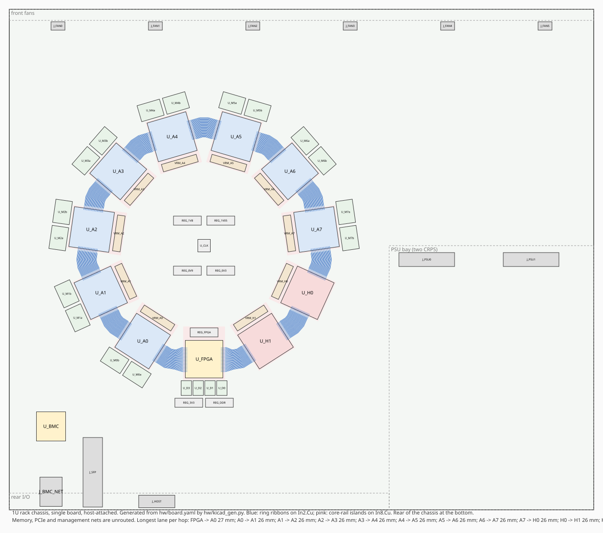

# Appliance board (revision A0)

Block-level schematic capture for the first appliance board. `board.yaml` is
the source of truth; `python -m hw.board` checks it and regenerates
`board.svg` (block diagram) and `board.md` (bill of materials, power, pin
budget, ring order). Two variants share the tools: `board_27b.yaml`, the
high-end 27B on HBM, and `board_psram.yaml`, the open-IP 9B on PSRAM
modules. Everything here is a budget to validate, not a vendor-
confirmed number, until the ASIC pinout and power are characterized.

```bash
python -m hw.board            # check, then write board.svg and board.md
python -m unittest discover -s hw/tests -t .
```

## Form factor: a host-attached 1U

The board is a single 420 × 360 mm board in a 1U rack chassis, attached to
a host over a PCIe cable. The first draft was a full-length PCIe card; the
energy model below moved it out of the slot. At 3 pJ per MAC the board
draws 0.5 to 1.6 kW of input across the throughput range, which is a rack
power supply and a row of fans, not a 600 W auxiliary connector on a
passively cooled card. The 1U also has the room the 50K tokens/s package
needs (29 mm bodies on a 230 mm ring) and a management controller. The
chassis layout:

* rear panel: the SlimSAS 8i host connector next to the FPGA, the BMC's
  RJ45, the optional SFP+ cage, the status LEDs;
* rear right: the PSU bay with two CRPS modules in a 1+1 redundant pair;
* the activation ring is a regular polygon in the left two thirds of the
  board, the FPGA at its rear vertex, the shared regulators and the clock
  generator in its middle;
* front: six 40 mm fans blowing front to back across the ring.

## Population

| Part | Qty | Role |
| --- | ---: | --- |
| Layer ASIC | 8 | four decoder layers each, personalized coefficient masks, layer-mode strap |
| Head ASIC | 2 | same die, head-mode strap, each holds half of the 248K-row LM head; no memory |
| LPDDR5X 16 Gb x32 | 16 | two per layer ASIC: 4 GB and 77 GB/s raw per ASIC at 9600 MT/s |
| Controller FPGA | 1 | PCIe Gen4 x8 endpoint over the host cable, ring source and sink, sampling, scheduling |
| DDR4 x16 | 4 | 4 GB on the FPGA for the embedding table and per-context metadata |
| Clock generator | 1 | reference clock to all eleven devices |
| BMC | 1 | AST2600-class: PSU PMBus, fan control, thermal, FPGA console, its own Ethernet |
| Host cable connector | 1 | SlimSAS 8i (SFF-8654): PCIe Gen4 x8 plus sideband to a host adapter card |
| CRPS receptacle | 2 | 12 V from each supply module, 1+1 redundant |
| Fan header | 6 | 4-pin PWM, one per front fan |
| SFP+ cage | 1 (optional) | standalone 10GbE operation, rear panel |

## Topology

One unidirectional activation ring:

```text
FPGA -> A0 -> A1 -> A2 -> A3 -> A4 -> A5 -> A6 -> A7 -> H0 -> H1 -> FPGA
```

Each hop is the 32-bit source-synchronous DDR link from the architecture doc
(36 signals, 2 GB/s raw, under 80 mm). Head chips forward the incoming hidden
vector unchanged and append their top-k logits and partial softmax sum, so no
broadcast path is needed. The FPGA merges the two lists and samples.

On the board the eleven ring nodes sit on the vertices of a regular 11-gon,
clockwise from the FPGA at the rear, each chip rotated so its link-in edge
faces the previous chip and its link-out edge the next. Every hop is then
the same short ribbon. Each layer ASIC's two LPDDR5X devices sit on its
outer edge and its core regulator on its inner edge, rotated with it. All
eleven nodes are on the polygon, heads and FPGA included, because a chip
takes the ring in on one edge and out on the opposite edge: a loop that
dipped into the middle for the heads would have to hairpin back out.

Management is a SPI bus from the FPGA with one chip select per ASIC, a JTAG
chain through all eleven devices, and a fanned-out reference clock. Each ASIC
has a two-pin mode strap (layer or head). The BMC owns the chassis: PSU
PMBus, fan PWM and tach, the core regulators' PMBus, the FPGA's UART
console, and its own Ethernet port.

## Power

ASIC power is no longer a placeholder: it is throughput times energy per
token, from the `power_model` block in `board.yaml`. The one measured input
is the energy of a fixed-weight multiply-accumulate in the column datapath,
0.39 pJ on ASAP7 at the tool's default activity
(`fabric/results/pnr_asap7_signoff.json`), which derates to about 1 pJ for
real activity and projects to 2 to 4 pJ on a 28 nm-class node; the model
carries 3 pJ. Each layer ASIC does 866M MACs per token (9B geometry), each
head ASIC 508M, and the layer ASICs also move about 7.35 MB per token
through their memory at roughly 40 pJ per byte: three 1 MB recurrent-state
read-and-write pairs and the global layer's index scan and selected KV. The other parts keep fixed
budgets (1 W per LPDDR5X, 25 W FPGA, 5 W BMC, 12 W per fan).

At the simulator's corrected 8.2K tokens/s design point that is 27 W per
layer ASIC and 366 W of load, 431 W of 12 V input at 85 percent regulator
efficiency. `board.md` tabulates the same at 5K, 25K and 50K tokens/s: the
board runs from about 330 W to 1.72 kW of input across the throughput range,
and a layer ASIC's core rail goes from 22 A to 184 A at 0.8 V. The supply is
therefore two 2000 W CRPS modules in a 1+1 redundant pair, one of which
carries the whole load, and each ASIC needs a multiphase core regulator.
A 7 nm-class die at about 1 pJ per MAC would put the whole range back under
600 W and make the card viable again; the process choice is the biggest
lever on the power supply and the enclosure.

The power tree is a 12 V intermediate bus from the CRPS modules into
point-of-load regulators. Each ASIC gets its own core buck with PMBus
telemetry so per-chip current is observable during bring-up. The LPDDR5X
rails, 1.8 V I/O, FPGA rails, DDR4 rails, and 3.3 V housekeeping are shared.

## Host interface: PCIe over a cable, and why not Ethernet or PoE

**PoE is out.** The highest PoE class (802.3bt Type 4) delivers 71 W to the
device. This board needs hundreds of watts at any useful throughput. Even a
4B-geometry build at the lowest rate in the table sits well above the PoE
ceiling once the FPGA and memory are counted.

**Ethernet as the data path is viable but not the first build.** The token
traffic is tiny. At 50K tokens/s with a few hundred bytes per token, both
directions together are under 20 MB/s, and a 128K prefill moves 512 KB of
token ids. Even 1GbE would carry it. The reasons to still start with PCIe:

* the FPGA's hard PCIe block is the cheapest working host link, with no
  network stack to write in fabric;
* PCIe round trips are a few microseconds, below the 250 to 500 µs token
  latency target, while a network hop adds tens of microseconds and jitter.

The 1U is host-attached: a SlimSAS 8i cable from the rear panel to a
retimer or host adapter card in the server next to it, the same arrangement
as an external PCIe expansion chassis. PCIe Gen4 x4 is enough bandwidth; the
board wires x8 because the FPGA's hard block is x8 and the cable carries it.

The SFP+ cage on the rear panel keeps the standalone-appliance option open.
The FPGA transceivers are there anyway, so a later firmware can serve a UDP
or gRPC-style token protocol over 10GbE with no board change, and the
chassis already has its own supply and management.

## ASIC package and ball map

`python -m hw.pinout` derives the ASIC package and its ball map from the
board description and writes `hw/pinout/asic_ballmap.csv`, `asic_ballmap.json`
and `report.md`. The pinout is co-designed with the die floorplan and the
substrate, and the substrate is the packaging house's work; what we owe them
is the ball count the power model demands, the package that carries it, and
a ball map with the constraints a substrate and a PCB can both route. The
rules live in the `package_selection` block of `board.yaml`:

* the core rail needs one ball per 0.5 A at the rated throughput, and ground
  matches it plus one return per four signal balls;
* signals sit in the outer three rows, where a through via escapes them;
* each interface owns a package edge, which is also the die-edge assignment
  for the I/O ring: link in west, link out east as two columns of 18 rows,
  both LPDDR5X channels on the north rows in byte lanes with a ground after
  each lane, management, JTAG, reference clock and mode strap on the south
  row, ground and the core rail in a checkerboard elsewhere;
* the smallest candidate package that satisfies all of that is selected.

The package is rated at the 50K tokens/s target, where the core rail draws
184 A: 369 core balls, 369 ground balls, 54 signal returns, 216 signals and
34 rail balls, 1042 in all. That selects a 1225-ball 35 × 35 array at
0.8 mm in a 29 mm body. The rating is what matters here, not the design
point: at the corrected 8.2K the same rules ask only for a 784-ball
package. The rating is a decision, and it fixes the package before the die
exists; the 1U was retargeted partly so the larger package fits.

The KiCad generator builds every ASIC footprint from this map, so the ball
pitch, the escape geometry, the via-in-pad counts and the ring's lane pitch
follow it. `hw/pinout/report.md` lists the candidates with the reason each
was rejected or chosen, the ball counts by use, and the memory signals that
sit deeper than the outer three rows and need a build-up escape.

## KiCad project

`python -m hw.kicad_gen` turns `board.yaml` into a KiCad 7 project under
`hw/kicad/` (`appliance.kicad_pro`, `.kicad_pcb`, `.kicad_sch` with four
sub-sheets, `report.md`, `floorplan.svg`). It regenerates from the YAML, so
the description stays the source of truth. The files are written directly in
KiCad's S-expression formats; the generator itself needs only PyYAML, and
KiCad is used to open and check the result. The tests run KiCad's own
design-rule check when its `pcbnew` Python module is installed (`apt install
kicad` on Ubuntu 24.04) and pass with no violation other than the unrouted
nets.



What the project contains:

* the 420 × 360 mm 1U board with its keep-outs (PSU bay, rear I/O strip,
  fan row), the SlimSAS host connector, the BMC and its RJ45, the two CRPS
  receptacles, six fan headers and the SFP+ cage, all placed physically and
  checked against the keep-outs;
* all 44 parts of `board.yaml` on generated footprints, plus one core
  regulator block per ASIC and seven shared-rail regulator blocks. The
  eleven ring chips sit on a regular 11-gon of 46 mm side (82 mm
  circumradius), each rotated tangentially, with its memories on the
  outer edge and its core regulator on the inner edge rotated with it;
  the FPGA's DDR4 and their regulators sit on its outer edge at the rear,
  the shared regulators and the clock generator in the middle of the
  polygon. Footprints are written with every pad and outline point
  already rotated, so any angle works;
* the ASIC ball map derived by `hw/pinout.py` (see above), shared by all ten
  ASICs, with the head ASICs' memory balls unconnected. The FPGA's link pins
  are assigned by the ribbon router; its other pins are placeholders;
* every net at the signal level (1,754 nets), so schematic and board agree:
  ring links, sixteen LPDDR5X channels, the DDR4 x64, PCIe to the host
  connector, management SPI, JTAG chain, reference clocks, mode straps,
  the BMC's fan, PMBus and console nets, and the rails;
* a twelve-layer stackup with four ground planes, a 12 V and I/O rail layer
  and a core-rail layer, via-in-pad on every ground and rail ball a zone can
  reach, and ground, 12 V, memory-PHY and core-rail zones;
* the activation ring fully routed: every hop is one 36-lane ribbon on
  In2.Cu at half the ball pitch that leaves and enters the ports straight
  and bends twice, by up to 23 degrees, in between. The longest lane of
  any hop is 27 mm against the 80 mm link limit, and all eleven hops are
  alike. The side is the package body plus 17 mm; 15 mm still passes
  DRC, and below that the ports are too close for a ribbon to bend.

What it does not contain, on purpose: routed memory, PCIe or management nets
(length matching and signal integrity are interactive work), decoupling,
regulator internals, thermal vias, mounting holes, chassis mechanicals, or
a real ASIC ball map. `report.md` carries the link lengths, the escape
density (the 130 memory signals per ASIC north edge need a build-up layer
pair to escape), and the core-rail current density: at 50K tokens/s a layer
ASIC draws about 184 A, which is over 90 A/mm² on a single 2 oz plane across
the package width, so the real board needs the regulator against the package
with several plane layers between them.

Why a polygon and not the two-row snake of the earlier drafts:

* The snake had two hops that carried all the risk, the row change and the
  closing hop into the FPGA, at 76 and 74 mm against the 80 mm limit with
  the 29 mm package, and only with the lanes compressed to 0.25 mm and
  split over two layers. On the polygon the longest lane anywhere is
  27 mm on one layer at the natural lane pitch, so the single-ended 1.8 V
  link has its margin back and the LVDS fallback is no longer needed for
  length.
* Airflow: in the snake each row of four sat in series in the front-to-back
  air, so the rear chip of a row breathed air heated by three 140 W
  packages. On the polygon the vertices are staggered and no chip sits
  directly behind more than one other.
* The chips are rotated by multiples of 32.7 degrees, so the memory escape
  routing and the regulators sit at angles to the board axes. KiCad and
  the fab do not mind; the memory length matching is no harder than on
  axis.
* The middle of the polygon (110 mm across) holds the clock generator,
  equidistant from every chip, and the shared regulators. The right third
  of the board is free apart from the PSU bay, so a shorter chassis is
  possible.

## The high-end variant: eight layer ASICs and two heads, HBM in the package

`board_27b.yaml` describes the 27B-class appliance on a 2 nm-class die
(`sim/config/qwen35_27b_2nm_hbm.json`): eight layer ASICs of eight layers
each (2.86B coefficients, about 76 mm² of fabric), two head ASICs splitting
the LM head by vocabulary at 22 percent of the same die, and an HBM4 stack
on each layer ASIC's interposer, so there is no memory on the board. The
same tools take it as a source (`--source hw/board_27b.yaml`) and write
`board_27b.md`, `board_27b.svg`, `pinout_27b/` and `kicad_27b/`:

* ten via personalisations per model, the same as the 9B board, and one
  product family with the 9B if that moves from four layers per die to the
  same eight;
* at the rating of 153K tokens/s the board draws 1.8 kW of load, 2.1 kW of
  input from a 1+1 pair of 3000 W CRPS modules, and about 200 W per layer
  package (153 W of die, 10 W static, 36 W of HBM4 traffic); at the 50K
  target it is 714 W of load, 840 W of input and 72 W per package;
* the package is a 35 × 35 array at 0.8 mm (1,225 balls, 1,150 needed):
  249 A on the core rail at the rating, 498 core balls, no memory balls,
  the north edge free for the HBM PHY towards the stack;
* the ring is a regular 11-gon of 51 mm side, 91 mm circumradius, with
  22 mm between the packages for the cold plates; every hop is 16 to 32 mm
  with bends of 16 to 20 degrees, and pcbnew DRC reports only the unrouted
  nets;
* the regulators follow the power tree: one block per shared rail (I/O,
  HBM core, HBM I/O) in the middle of the polygon, the FPGA's rails on one
  block, DDR4 rails and 3.3 V beside the DDR4 row.

Cooling is direct-to-chip liquid, but eight layer dies rather than four
make it an ordinary problem: 200 W over a 29 mm package is about 24 W/cm²
at the lid and roughly 150 W/cm² at the die, which a microchannel cold
plate handles with a few kelvin of rise at 1 l/min per plate. The board
still assumes bare-die cold plates, a rear quick-disconnect pair, coolant
flow and leak sensing on the BMC, and fans only for the regulators, DDR4
and FPGA, because the 12 V input at 2.1 kW is 175 A across the board and
the dies sit shoulder to shoulder on the polygon. The per-die core rail at
249 A is what an ordinary multiphase point-of-load delivers to a plane; it
was the four-die arrangement, at 650 A, that wanted the regulator on the
package substrate or backside power delivery on the die.

This is a re-rating. The board was four layer dies of sixteen layers and
one head die at 234K tokens/s, which came from the simulator before its
memory model counted recurrent-state traffic and before the stages of a die
shared one memory interface. Corrected, that arrangement runs at 77K: the
twelve recurrent states per die saturate the stack, and dies, not tiles,
are what buys throughput. Eight dies of eight layers reach 153K for the
same silicon and twice the via personalisations, ten rather than five, and
take the package down two sizes with them.

## The open-IP variant: sixteen PSRAMs per chip, so the chips go on cards

`board_psram.yaml` describes the 9B geometry on the 28 nm-class die with
sixteen HPI x16 PSRAM devices per layer ASIC and no DRAM PHY anywhere in
the design (`sim/config/qwen35_9b_psram16.json`, 2.5K tokens/s). Sixteen
devices are 304 memory signals, and a die that escapes them onto a
motherboard beside nine other chips needs a 45 × 45 package and a ring
too big for the chassis. So this variant is modular: every ring chip sits
on its own card with its memory and its core regulator, and only the
ring, the management buses and 12 V cross the card edge. The same tools
take it as a source and write `board_psram.md`, `board_psram.svg`,
`pinout_psram/` and `kicad_psram/`, the last holding two PCBs:
`appliance.kicad_pcb` is the motherboard and `module.kicad_pcb` the card.

What crosses the connector decides everything else:

| | Contacts |
| --- | ---: |
| Memory card, chip left on the motherboard | 488 |
| Module: chip, memory and regulator on the card | 108, then **48** with the 8-bit link |

The link is 8 bits wide here (12 signals per port, 125 MHz DDR, 250 MB/s
raw against 10 MB/s used): this board needs a hundredth of the single
board's link bandwidth, and twelve-position finger groups are what let
the slot-to-slot ribbons jog between cards. With both link ports on the
die's south edge the die itself shrinks to a **28 × 28 array at 0.8 mm,
23 mm body**, 540 balls of 784: 304 memory signals in the outer five rows
of the north, east and west edges (the card is HDI), the two link blocks
side by side on the south edge with the management pins between them, and
21 A of core current at the 5K rating, which is 43 balls. The pinout is
memory-bound where the other boards' are current-bound.

The card is 110 × 70 mm with PCIe x16 fingers used mechanically: 12 V and
ground on the short section, link_in on twelve side-A positions and
link_out on the **same** twelve side-B positions, the management pins after
them. Sharing the positions is what makes every slot-to-slot hop on the
motherboard a straight ribbon: a slot's out-row pin faces the next slot's
in-row pin. On the card it means the two drops from the die's two south-edge
blocks lean towards one finger span from either side and cross, so the
in drop runs on `In2.Cu` and the out drop on `In3.Cu`, and the two faces'
vias sit interleaved half a position apart just above the fingers. Each
drop is 17 to 23 mm at 37 degrees, the lanes fanning from 0.4 mm to 1.0 mm
on the way down. The sixteen PSRAMs stand in two rows of eight above the
chip; the core VRM and the 1.8 V regulator stand at the right end, so the
0.8 V current never crosses a connector: a module takes about 20 W as
1.7 A at 12 V. The head module is the same card with the memory sites
empty.

The motherboard is six layers (signal, ground, the link, 12 V and the
FPGA's rails, ground, signal) with ten slots at 22 mm pitch in **one
folded row**: the outbound cards in the even positions running away from
the FPGA, the returning cards in the odd positions between them, so the
ring order 0 to 9 sits at positions 0, 2, 4, 6, 8 and 9, 7, 5, 3, 1. Every
hop skips one slot, the turn at the far end is a square U round the last
slot, and the ring closes on the FPGA's east edge, which carries both link
ports side by side exactly as the die does.

The slots are through-hole, the commodity part, and the skipped slot's
pins are cleared by a **stagger**, not by weaving: the two sets of slots
sit 38 mm apart along the cards, so each set's ribbon band, which runs at
its link end, passes beyond the far end of the other set's pins. The
stagger is derived from the geometry (half a slot, the ribbon's half width
with its escapes, the link group's distance from the slot centre and a
clearance), and the report states it; putting in and out on the same
positions narrowed the band from 27 mm to 12 and the stagger from 52 mm to
38. `slot_kind: smt` puts both sets on one line instead, a surface-mount
slot letting inner-layer ribbons pass beneath it, and saves the 38 mm at
the price of a less ordinary part. The cards stand parallel to the
front-to-back airflow. Hop lengths in `report.md` are end to end, the
card's out drop plus the motherboard ribbon plus the next card's in drop:
87 mm slot to slot with **no bend**, 190 mm at the turn, 76 and 92 mm for
the FPGA hops, against a 200 mm limit the slower link allows. The turn is
the hop to watch: it is the one that pays for the stagger twice.

The fold is what sets the board's depth. The slot field is the card's
89 mm plus the stagger, so the board is **420 × 170 mm** (`2u_short`): the
rear I/O strip, the slot row, the fans, the FPGA and its DDR4 beside the
end slots, and the PSU bay, whose CRPS modules are longer than the board
and overhang its front edge inside the chassis. `layout: two_rows` in the
description still produces the earlier two facing rows on the full-depth
2U, for comparison.

Three consequences are worth stating. The motherboard turned cheap and the
card became the only hard board, and the card is small and built ten
times, so a mistake in the memory escape scraps 77 cm², not 1,500. The
chassis is a short-depth 2U, the card needing about 50 mm of height with
its connector and the board 170 mm of depth. And a module can be brought
up on its own against the FPGA before the other nine exist, which the
single board cannot offer.

Placeholders, beyond the usual ones: the finger and slot geometry stand
in for a real connector drawing, and the PSRAM is an 8 × 8 mm 49-ball body
until a part is chosen.

## Open items before schematic entry in an EDA tool

1. ASIC package and ball map: the derived map in `hw/pinout/` goes to the
   packaging house with the bump map once the die floorplan exists; the
   substrate design and the final map come back from them.
2. Measured energy per MAC on the target process, which sets the core
   regulator sizing and the supply rating; the 3 pJ in `board.yaml` is a
   projection from the ASAP7 signoff run.
3. Link I/O standard: 1.8 V single-ended at 500 Mb/s per pin needs a signal
   integrity check at 80 mm; fall back to eight LVDS pairs at 2 Gb/s if it
   fails.
4. LPDDR5X versus GDDR6. The simulator wants 75 to 100 GB/s per ASIC with
   int4 KV; two LPDDR5X-9600 x32 devices give 77 GB/s raw. GDDR6 doubles that
   at higher PHY effort and power.
5. FPGA part selection against the pin budget in `board.md`: two links, DDR4
   x64, PCIe x8, SPI with ten chip selects, JTAG, optional SFP+.
6. Host side: the retimer or adapter card and the cable length the Gen4
   link tolerates; the fallback is a Gen3 cable or a redriver at the
   rear panel.
7. Thermal: 1.4 kW of load in 1U at 50K tokens/s is at the limit of
   front-to-back air over 29 mm packages even with the staggered polygon;
   the 25K row (0.8 kW) is the comfortable air-cooled point.
